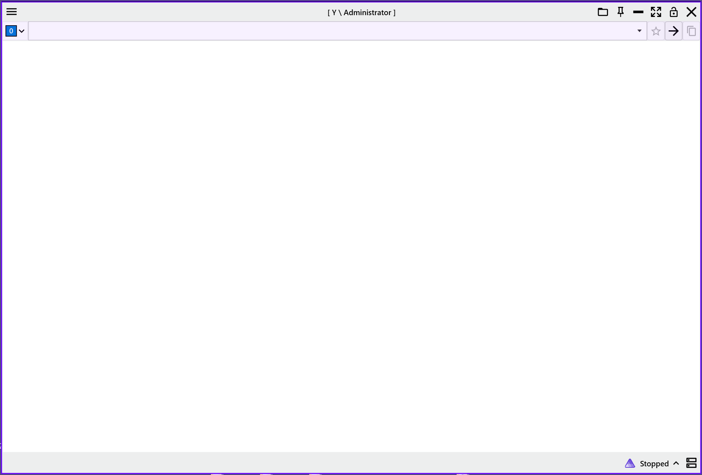
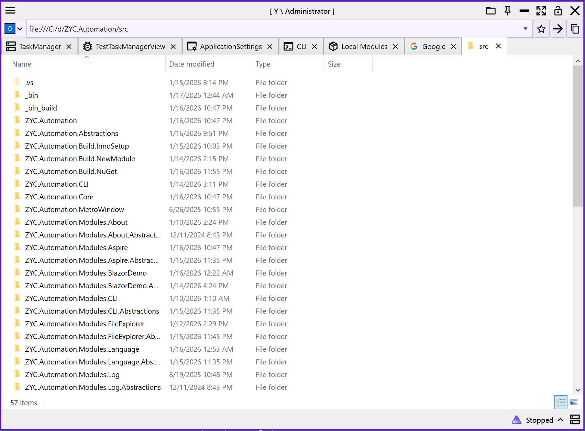
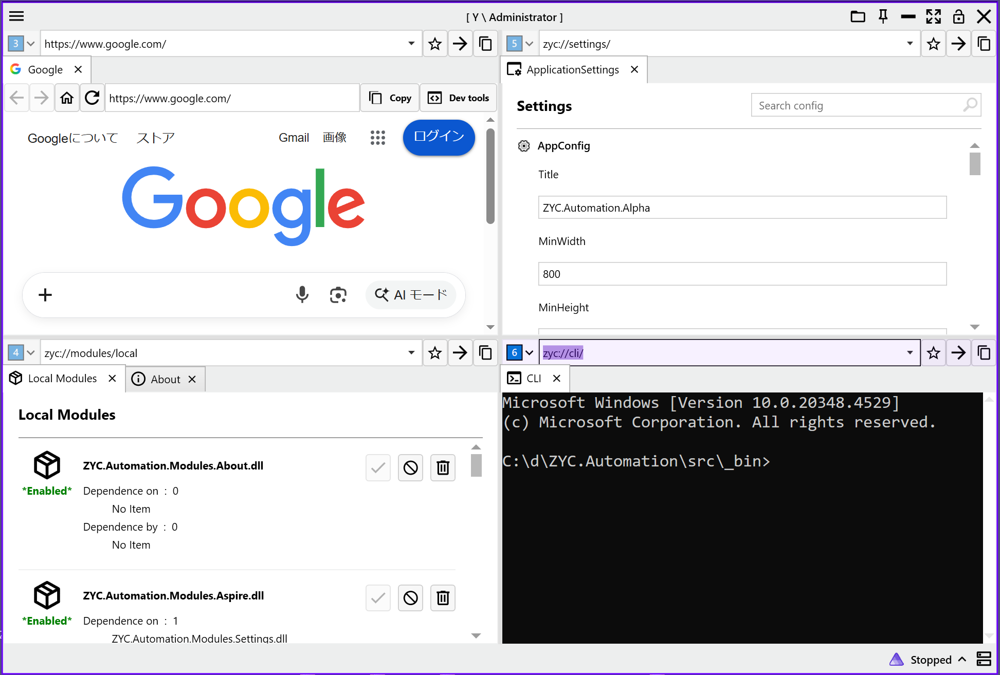
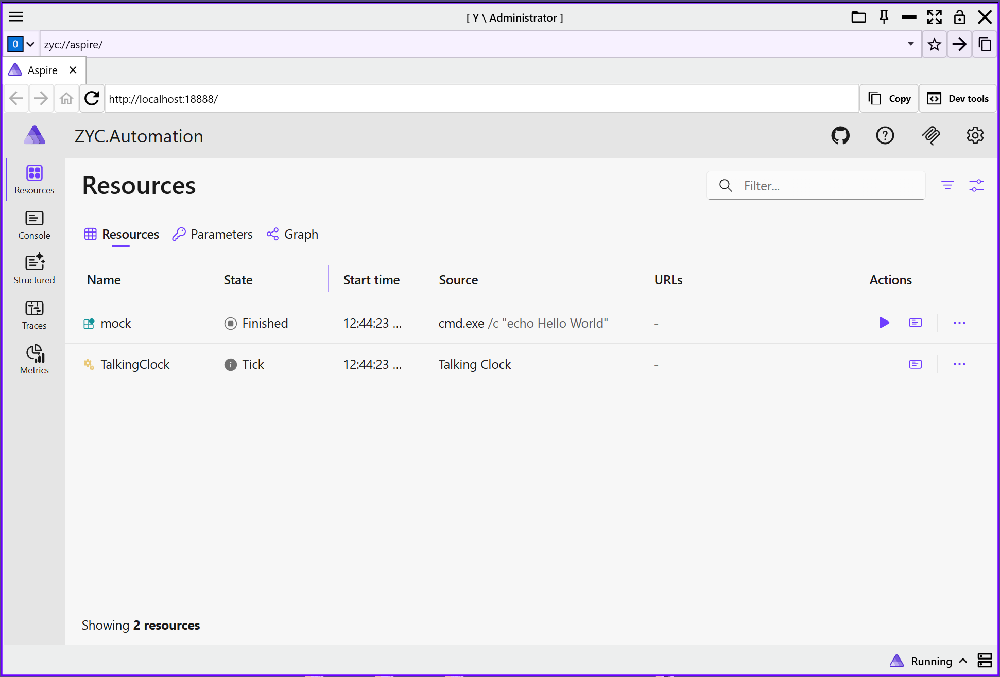
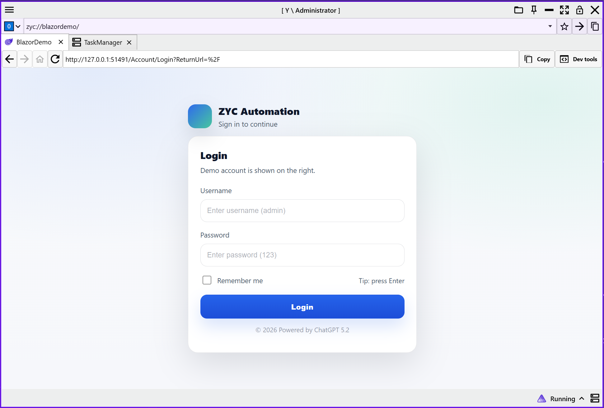
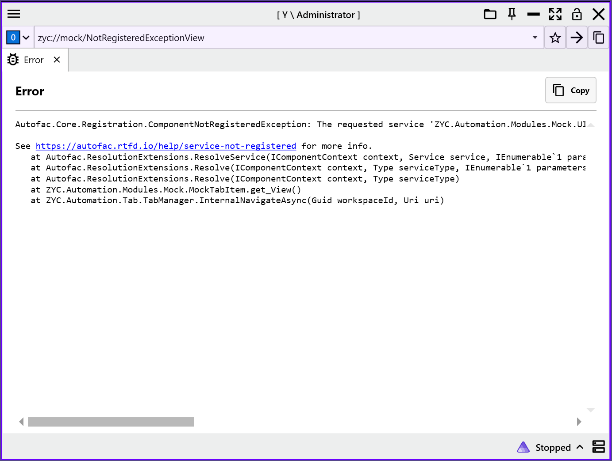
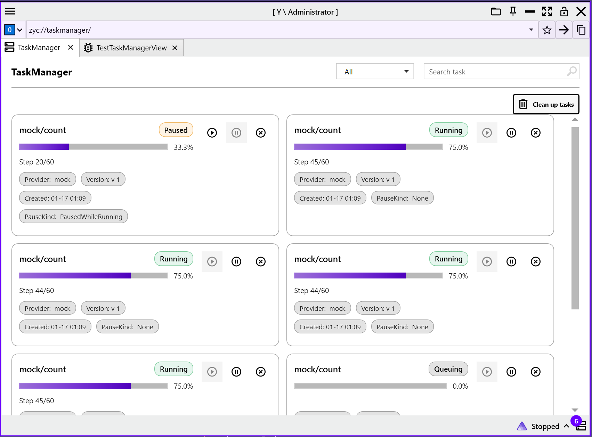

<p align="center">
  <a href="./README.md">English</a> |
  <a href="./README.ja.md">日本語</a> |
  <a href="./README.zh-CN.md">简体中文</a> |
  <a href="./README.zh-TW.md">简體中文</a> |
  <a href="./README.ko.md">한국어</a> |
</p>

<p align="center">

</p>

<h1 align="center">ZYC.Automation</h1>

<p align="center">
基于 <b>.NET 10</b> 和 <b>WPF</b> 构建的高性能、多模块、可扩展自动化开发框架。
</p>

<p align="center">
  <a href="https://www.nuget.org/packages/ZYC.Automation.Alpha">
    
  </a>
    <a href="https://www.nuget.org/packages/ZYC.Automation.Alpha">
    
  </a>
  <a href="https://raw.githubusercontent.com/ZiYuCai1984/Temp/refs/heads/main/ZYC.Automation.Setup.exe">
    
  </a>
  
  
  
</p>

<p align="center">
  <a href="https://github.com/ZiYuCai1984/ZYC.Automation/actions/workflows/publish-nuget-manual.yml">
    
  </a>
  <a href="https://github.com/ZiYuCai1984/ZYC.Automation/actions/workflows/publish-nuget-nightly.yml">
    
  </a>
</p>

---

## 📖 项目简介

**ZYC.Automation** 是一个现代化的桌面自动化解决方案。它结合了 WPF 的强大 UI 表现力和 .NET 10 的最新特性，旨在通过模块化架构简化复杂自动化系统的开发流程。

项目深度集成了 **.NET Aspire** 用于分布式应用编排，并支持 **Blazor** 与 **WebView2** 的混合开发模式，让你可以自由选择 Web 或 原生技术栈。

---

## ✨ 核心特性

* **多模块架构**：解耦业务逻辑，支持动态加载与独立开发。
* **现代化 UI 支持**：基于 WPF，支持多工作区（Multi-Workspace）与多标签页（Multi-Tab）交互。
* **混合开发模式**：
  * 集成 **WebView2**，轻松嵌入现代 Web 应用。
  * 集成 **Blazor**，实现 Web 组件与桌面端逻辑的无缝复用。
* **云原生就绪**：内置对 **.NET Aspire** 的支持，简化服务发现、治理与部署。
* **企业级内置支持**：
  * **任务管理**：任务调度与生命周期管理。
  * **异常处理**：全局错误捕获与日志追溯机制。
  * **本地化框架**：内置多语言支持方案，适应全球化场景。


---

## 📸 界面预览


<table align="center">
  <tr>
    <td>
      
      <p align="center">工作区展示</p>
    </td>
    <td>
      
      <p align="center">多 Tab 展示</p>
    </td>
  </tr>

  <tr>
    <td>
      
      <p align="center">多工作区展示</p>
    </td>
    <td>
      
      <p align="center">多工作区 Tab 展示</p>
    </td>
  </tr>

  <tr>
    <td>
      
      <p align="center">Aspire 仪表板</p>
    </td>
    <td>
      
      <p align="center">Blazor with Auth</p>
    </td>
  </tr>

  <tr>
    <td>
      
      <p align="center">异常处理</p>
    </td>
    <td>
      
      <p align="center">任务管理</p>
    </td>
  </tr>
</table>


---

## 🛠️ 技术栈

* **Runtime**: .NET 10 SDK
* **UI Framework**: WPF (Windows Presentation Foundation)
* **Hybrid**: Microsoft Edge WebView2 & Blazor Hybrid
* **Orchestration**: .NET Aspire
* **Architecture**: Modular Monolith / Plugin-based

---

## 🚀 快速开始

请参阅我们准备好的详细指南：

👉 **[快速开始指南 (quick-start.md)](docs/quick-start.md)**

### 安装

你可以通过 NuGet 直接将核心包引入你的项目：

```bash
dotnet add package ZYC.Automation.Alpha --version [版本号]
```

---

## 🏗️ 项目结构

```text
ZYC.Automation
├── src
│   ├── ZYC.Automation                         # WPF desktop host/entry: main window, workspaces, menus, UI lifecycle
│   ├── ZYC.Automation.Abstractions            # Shared contracts: interfaces, states, configs used across host/modules
│   ├── ZYC.Automation.Core                    # Core infrastructure: commands, bindings, converters, base UI components, i18n
│   ├── ZYC.Automation.MetroWindow             # Metro-style window shell (alternative window implementation)
│   ├── ZYC.Automation.WebView2                # WebView2 hosting layer: navigation, menu bar, interop, page hosting
│   ├── ZYC.Automation.CLI                     # CLI tool: developer utilities, module/file helpers, automation entrypoints
│   ├── ZYC.Automation.Build.*                 # Build & packaging toolchain
│   │   ├── ZYC.Automation.Build.NuGet         # NuGet packaging tool: build/.props/.targets, README, PatchNote, outputs
│   │   ├── ZYC.Automation.Build.InnoSetup     # Inno Setup builder: produces the Windows installer (setup)
│   │   └── ZYC.Automation.Build.NewModule     # Module scaffolder: templates for Module + Abstractions projects
│   ├── ZYC.Automation.Modules.*               # Feature modules
│   │   ├── ZYC.Automation.Modules.About                  # About / version info page (UI + tab)
│   │   ├── ZYC.Automation.Modules.Aspire                 # .NET Aspire AppHost/orchestration integration + dashboard
│   │   ├── ZYC.Automation.Modules.BlazorDemo             # Blazor Server demo: web UI + auth/integration showcase
│   │   ├── ZYC.Automation.Modules.CLI                    # In-app CLI module (terminal-like tools page)
│   │   ├── ZYC.Automation.Modules.FileExplorer           # File Explorer module (Explorer-like browsing in tabs)
│   │   ├── ZYC.Automation.Modules.Language               # Language/i18n module: language switching + resources config
│   │   ├── ZYC.Automation.Modules.Log                    # Logging module: view logs, open log folder, log plumbing
│   │   ├── ZYC.Automation.Modules.Mock                   # Test/demo module for validating UI/notifications/tasks/workspaces
│   │   ├── ZYC.Automation.Modules.ModuleManager          # Module manager: enable/disable/install/uninstall (local + NuGet)
│   │   ├── ZYC.Automation.Modules.NuGet                  # NuGet access layer: sources, metadata, version utilities
│   │   ├── ZYC.Automation.Modules.Secrets                # Secrets utilities: password generator, Wi-Fi password, secrets UI
│   │   ├── ZYC.Automation.Modules.Settings               # Settings module: settings UI, grouping, reset actions
│   │   ├── ZYC.Automation.Modules.TaskManager            # Task manager: queue/progress/pause/cancel/cleanup framework
│   │   ├── ZYC.Automation.Modules.Translator             # Translator module: integrates translation services/local runner
│   │   ├── ZYC.Automation.Modules.Update                 # Update module: check/download/apply+restart, fault handling UI
│   │   └── ZYC.Automation.Modules.WebBrowser             # Built-in web browser module (tab-hosted browsing)
│   └── Thirdparty                           # Integrated third-party components (vendored/forked)
│       ├── ZYC.Automation.Terminal           # Terminal/ConPTY integration: pseudo console, PTY, process + pipes
│       ├── ZYC.MdXaml                        # Markdown renderer + extensions
│       └── ZYC.Titanium.Web.Proxy            # HTTP(S) proxy core (integrated Titanium Web Proxy fork)
```
---


## 📄 开源协议

本项目基于 [MIT License](LICENSE) 开源。


## 💖 鸣谢

本项目使用了以下开源库/参考了其部分实现：
- [MahApps.Metro](https://github.com/MahApps/MahApps.Metro): UI 框架支持。
- [MdXaml](https://github.com/whistyun/MdXaml): 文档预览支持。
- [titanium-web-proxy](https://github.com/justcoding121/titanium-web-proxy): 网络代理核心。
- [EasyWindowsTerminalControl](https://github.com/mitchcapper/EasyWindowsTerminalControl): 终端集成方案。

> 以上项目的许可证归其原作者所有；本仓库在遵循对应许可证条款的前提下使用/参考其实现。

## 🤝 贡献

如果你有任何建议或发现了 Bug，欢迎提交 Issue 或 Pull Request。
