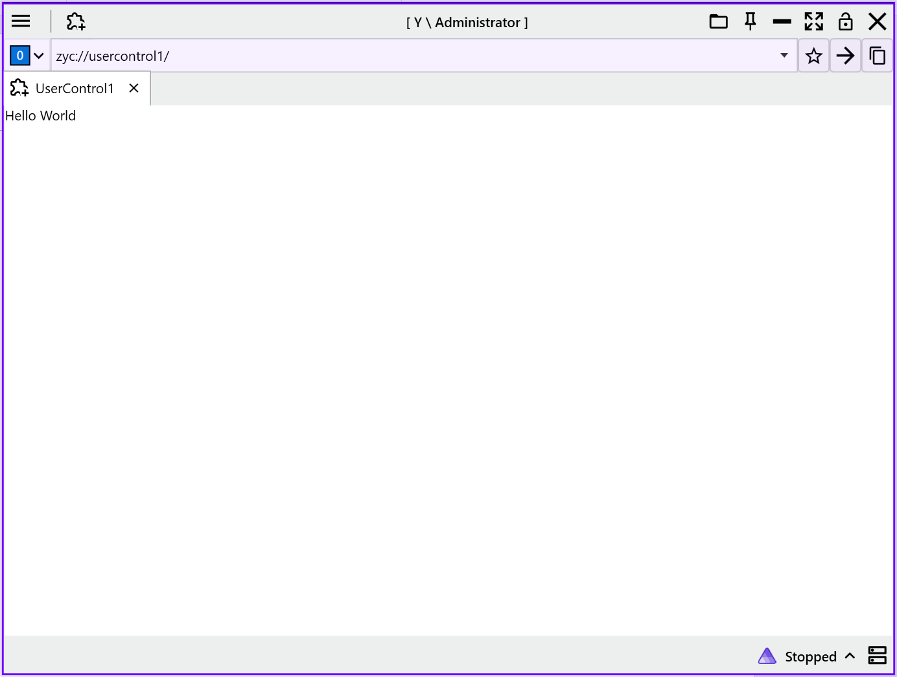

# 🚀 Quick Start: Getting Started with ZYC.Automation Host

This guide will walk you through creating a **ZYC.Automation Host** project from scratch. You will learn how to integrate the framework via NuGet and use the modular system (Module + UserControl) to mount your custom UI into the host environment. 🛠️

---

## 1. 🧱 Project Setup & Prerequisites

1. **Create Project**: Create a new **WPF Application** targeting **.NET 10** (e.g., name it `WpfApp1`). ✨
2. **Add NuGet Package**: Install the core framework package `ZYC.Automation.Alpha` via NuGet Package Manager. 📦

```xml
<ItemGroup>
  <PackageReference Include="ZYC.Automation.Alpha" Version="1.0.1" />
</ItemGroup>
```

3. **Clean Up Default Entry Point**: 🧹
The framework provides its own unified entry point (`Entry.cs`). You **must delete** the following default files generated by the template:
* `App.xaml`
* `App.xaml.cs`


> [!IMPORTANT]
> ⚠️ **Critical Step**: You must delete `App.xaml`, otherwise a global entry point conflict will occur. The framework will take full control of the application startup logic.

---

## 2. ⚙️ Configure Assembly References

To ensure the host correctly identifies and loads the abstraction interfaces, manually add the reference to the `Abstractions` assembly in your `.csproj` file: 🔗

```xml
<ItemGroup>
  <Reference Include="ZYC.Automation.Abstractions">
    <HintPath>$(OutputPath)ZYC.Automation.Abstractions.dll</HintPath>
  </Reference>
</ItemGroup>
```

---

## 3. 🛠️ Implement the Business Module (Module.cs)

Create a `Module.cs` file in your project root. This class acts as the "brain" of your module, defining loading logic and registering UI pages to the host. 🧠

```csharp
using Autofac;
using ZYC.Automation.Abstractions.Tab;
using ZYC.CoreToolkit;
using ZYC.CoreToolkit.Extensions.Autofac;

namespace WpfApp1;

internal class Module : ModuleBase
{
    public override Task LoadAsync(ILifetimeScope lifetimeScope)
    {
        // Optional: Attach the built-in debugger tools
        DebuggerTools.Attach();

        // Resolve the Tab Manager and register your UI component
        var simpleTabItemFactoryManager = lifetimeScope.Resolve<ISimpleTabItemFactoryManager>();
        simpleTabItemFactoryManager.Register(new SimpleTabItemFactoryInfo(typeof(UserControl1)));

        return base.LoadAsync(lifetimeScope);
    }
}
```

---

## 4. 🎨 Create the UI Component

Create a new `UserControl1` (WPF User Control) and add the `[Register]` attribute. This allows the framework's Dependency Injection (DI) container to automatically recognize and manage it. 🖥️

```csharp
using ZYC.CoreToolkit.Extensions.Autofac.Attributes;

namespace WpfApp1;

[Register] // Automatically register to DI container
public partial class UserControl1
{
    public UserControl1()
    {
        InitializeComponent();
    }
}
```

---

## 5. 📄 Add Module Configuration

Create a `ModuleConfig.json` file in the project root. This file serves as a "map" for the host, telling it which assemblies to load dynamically. ⚙️

1. **File Content**:
```json
{
  "AdditionalAssemblyNames": [
    "WpfApp1.dll"
  ],
  "DisabledAssemblyNames": []
}
```


2. **Property Settings**: 📌
Select the file in the Solution Explorer and set **Copy to Output Directory** to **Copy always** in the Properties panel.

> 💡 **Tip**: `AdditionalAssemblyNames` must include the name of the assembly that contains your `Module.cs`.

---

## 6. ▶️ Run and Debug

1. **Set Startup Project**: Set this WPF project as the **Startup Project** of your solution.
2. **Start Debugging**: Press `F5`.

🎉 **Expected Result**:
The host will launch, scan `ModuleConfig.json`, and load the `WpfApp1` module. Your registered `UserControl1` page will automatically appear as a new tab in the main interface!

---

